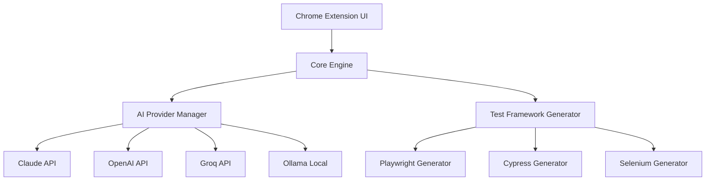
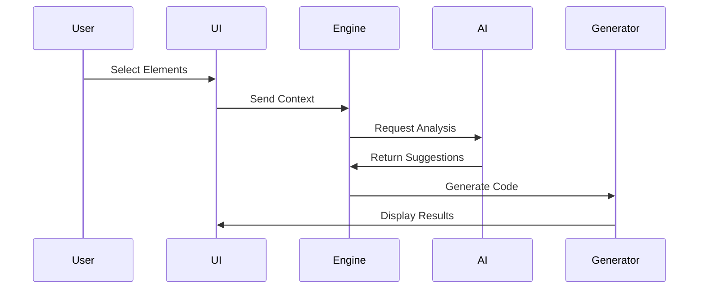
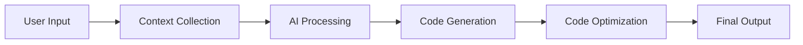

# Testron Architecture

## System Overview

### High-Level Architecture

## Component Details

### 1. Chrome Extension UI
- **Purpose**: User interface and element inspection
- **Key Components**:
  - Element Inspector
  - Code Editor
  - Settings Manager
  - Cost Calculator

### 2. Core Engine
- **Purpose**: Central processing and coordination
- **Responsibilities**:
  - Request Processing
  - Context Management
  - Code Generation
  - Error Handling

### 3. AI Provider Manager
- **Purpose**: AI service integration and management
- **Features**:
  - Provider Selection
  - API Key Management
  - Cost Tracking

### User Interaction Flow

### Test Generation Process

