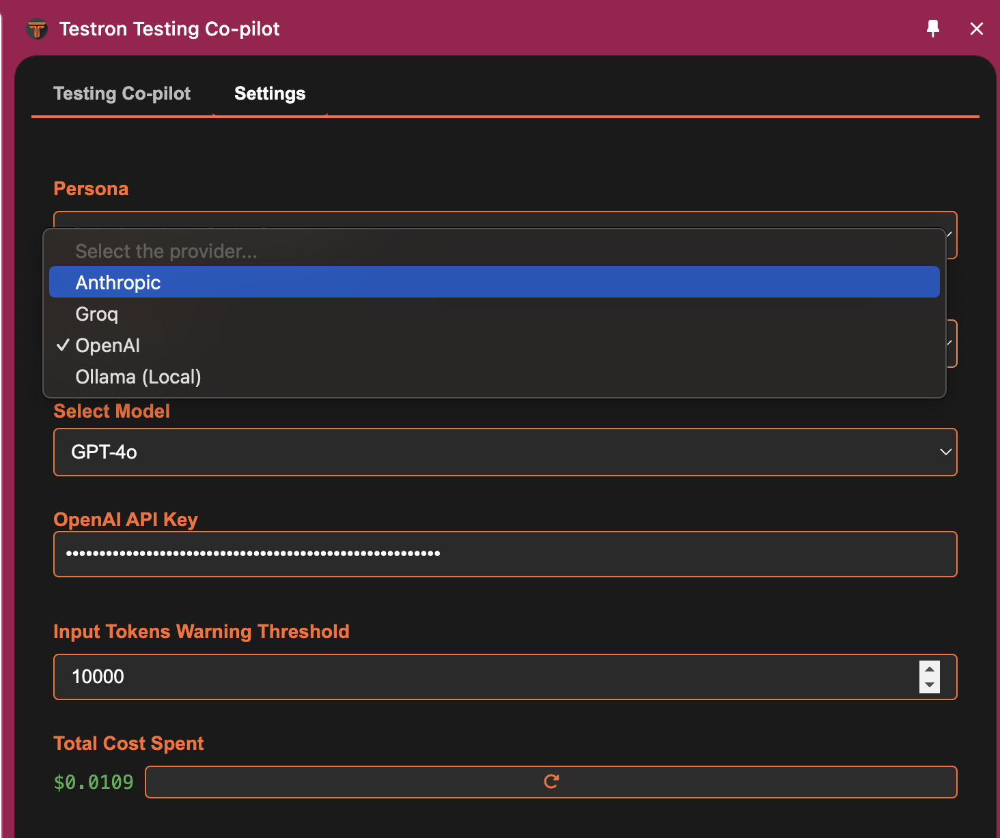
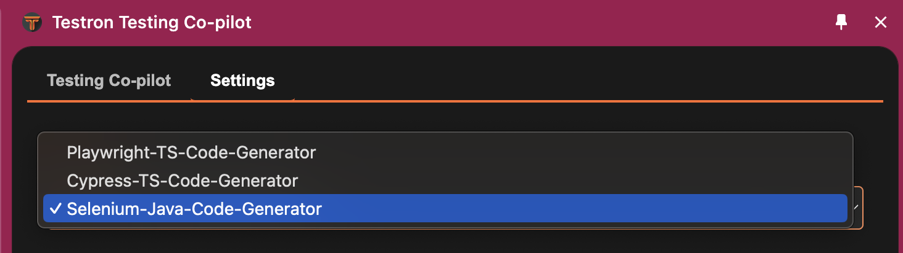
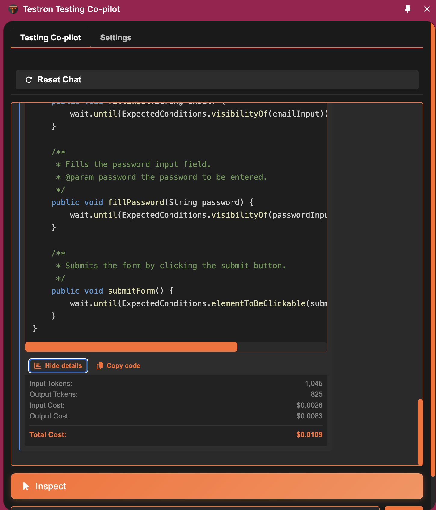

# Testron Features

## AI Provider Integration

### Supported AI Providers
- **Anthropic (Claude)**
  - Models: claude-3-5-sonnet-20241022, claude-3-5-haiku-20241022
  - Best for: Complex test scenarios and natural language understanding
  
- **OpenAI (GPT)**
  - Models: GPT-4 Turbo, GPT-4 Turbo Mini, GPT-3.5 Turbo
  - Best for: General test generation and code optimization

- **Groq**
  - Models: llama-3.3-70b-versatile, llama-3.1-8b-instant
  - Best for: Fast response times and efficient processing

- **Ollama (Local LLM)**
  - Models: llama3.2, llama3.1
  - Best for: Offline usage and data privacy

*The settings interface allows easy switching between AI providers and models while tracking costs*

## Test Framework Support

### Supported Frameworks

* Playwright with TypeScript*
* Cypress with TypeScript
* Selenium with Java

*The framework selector allows choosing between Playwright, Cypress, and Selenium test automation frameworks*

## Visual Element Inspector

### Key Capabilities
- Smart element detection
- Multiple elements selection

## Smart Test Code Generation

### Code Features
- Framework-specific best practices
- Error handling
- Integration with faker library to generate realistic test data
- Data parameterization
- Page Object patterns
- Custom assertions

## Cost Management

### Token Usage Control
- Input token warnings
- Usage thresholds
- Cost tracking
- Usage analytics
- Reset options

### Cost Optimization
- Local LLM support
- Token usage estimates
- Cost-effective model selection

## Context-Aware Suggestions

### Smart Features
- Element relationship detection
- Test scenario recommendations
- Code optimization suggestions

## Coming Soon
- Support for more languages and frameworks
- Support for code generation of more complex test scdnarios which spans across multiple pages.
- Follow up conversation with the generated code.