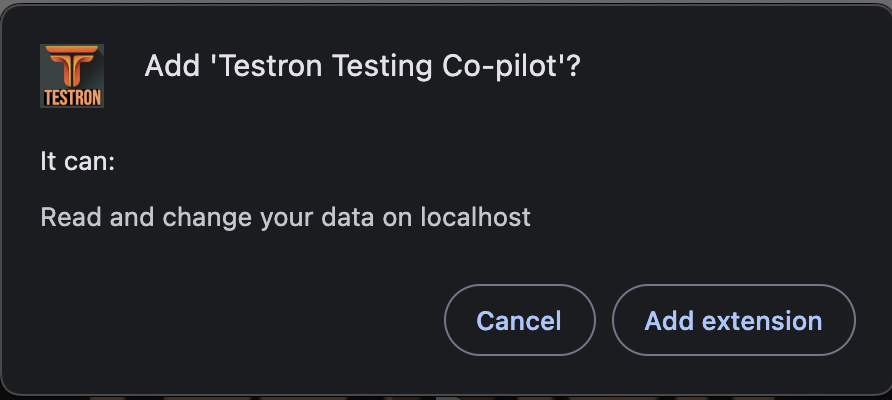
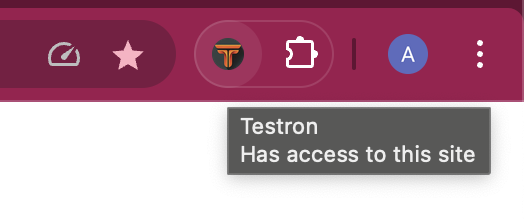

# Testron Installation Guide

## Prerequisites

### System Requirements
- Google Chrome (Version 88+) or Chromium-based browser
- 4GB RAM (minimum)
- 1GB free disk space
- Internet connection
- Node.js 16+ (for local development)
- Python 3.8+ (for Ollama setup)

## Installation Methods

### Chrome Web Store
1. Visit the [Chrome Web Store](https://chromewebstore.google.com/detail/testron-testing-co-pilot/ipbkoaadeihckgcdnbnahnooojmjoffm)
2. Click `Add to Chrome`
3. Click on `Add extension` button on this dialog
   
   This dialog is shown as this extension requires localhost access to connect to local ollama models.
4. Follow the browser prompts
5. Once installed, you can access the extension from the Chrome toolbar as shown below:
   

## AI Provider Setup

### Recommended: Start with Groq (Free Tier)
1. Visit [Groq](https://groq.com)
2. Create a free account (No credit card required)
3. Generate API key instantly
4. Add key to Testron settings

✨ **Why Start with Groq?**
- No credit card required
- Generous free tier
- Fast response times
- High-quality LLama models
- Simple setup process

### Alternative Providers (Require Credit Card)

#### Anthropic (Claude)
1. Visit [Anthropic](https://anthropic.com)
2. Create an account (Credit card required)
3. Generate API key
4. Copy API key to Testron settings

#### OpenAI
1. Visit [OpenAI Platform](https://platform.openai.com)
2. Sign up/Login (Credit card required)
3. Navigate to API section
4. Create new API key
5. Copy key to Testron settings

### Free Local Option: Ollama

#### Mac Installation
```bash
# Install Ollama
brew install ollama

# Pull required models
ollama pull llama3.2
ollama pull llama3.1

# Run with CORS enabled
OLLAMA_ORIGINS='chrome-extension://*' ollama serve
```

#### Linux Installation
```bash
# Install Ollama
curl -fsSL https://ollama.com/install.sh | sh

# Pull models
ollama pull llama3.2
ollama pull llama3.1

# Run with CORS
OLLAMA_ORIGINS='chrome-extension://*' ollama serve
```

#### Windows Installation
```powershell
# Download Ollama installer
# Run installer
# Open PowerShell as Admin

# Set CORS and run
set OLLAMA_ORIGINS=chrome-extension://*
ollama serve

# Pull models
ollama pull llama3.2
ollama pull llama3.1
```

## Initial Configuration

### Extension Settings
1. Click Testron icon
2. Open Settings
3. Configure:
   - Preferred AI provider
   - API keys
   - Input Token limit threshold
   - Framework preferences


## Troubleshooting

### Common Issues

#### Extension Not Loading
```bash
1. Verify developer mode is enabled
2. Check extension directory structure
3. Reload extension
4. Restart Chrome
```

#### API Connection Errors
```bash
1. Verify API keys
2. Check internet connection
3. Confirm API service status
4. Review error logs
```

#### Ollama Issues
```bash
1. Verify CORS settings
2. Check model installation
3. Restart Ollama service
4. Review system resources
```


## Updates and Maintenance

### Extension Updates
1. Auto-updates (Web Store version)